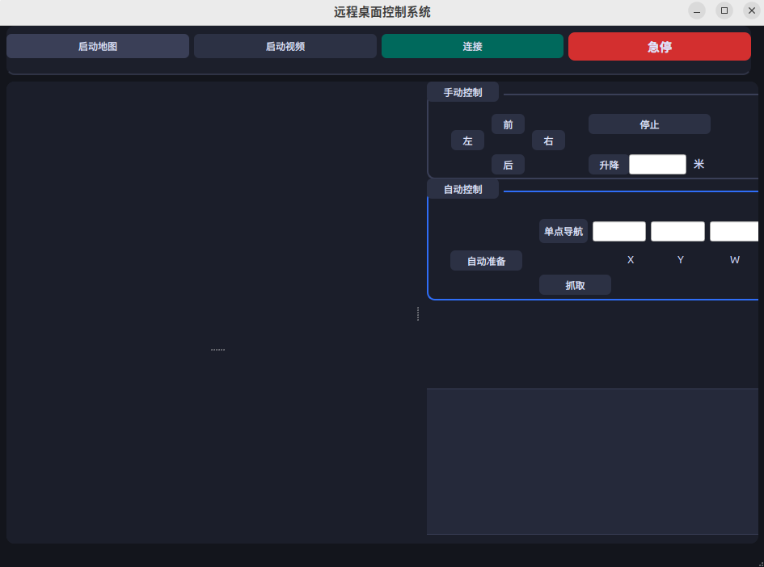
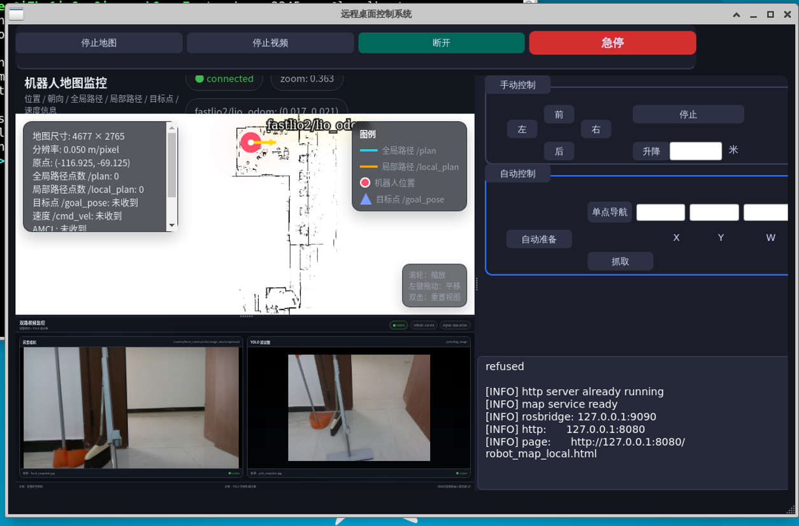

# Robot Remote Control Platform

一个面向 Linux 服务器部署的 Qt 机器人控制界面，用于通过 SSH 远程触发机器人端 ROS2 脚本，并在 GUI 内嵌显示地图与双路视频页面。

---

## 项目简介

本项目由 **Qt GUI（服务器端）** + **ROS2/脚本服务（机器人端）** 组成：

- 服务器端运行 Qt 程序（`main.cpp` + `mainwindow.*`），提供连接、手动控制、自动控制、地图/视频显示、日志输出等功能。
- 机器人端提供 ROS2 控制脚本与地图/视频服务脚本（`rpp_tools/*.sh`、`map_bridge.py`、`video_mjpeg_server.py`、`rpp_tools/html/*`）。
- GUI 点击“连接”后，会尝试通过 `localhost:<端口>` 建立 SSH 与本地端口转发（8080/8081/9090），这意味着现场部署通常依赖“机器人 -> 服务器”的反向 SSH 链路。

> 注意：机器人连接参数采用占位符管理，实际部署时需根据机器人网络环境进行配置。

---

## 项目界面

 


## 项目框架

具体请看(docs/architecture.txt)

## 项目目录结构

```text
.
├── main.cpp
├── mainwindow.h
├── mainwindow.cpp
├── mainwindow.ui
├── ros2_pub_gui.pro
└── docs
    ├── gui0.png
    ├── gui1.png
    ├── trajectory.txt
└── rpp_tools
    ├── forward.sh / backward.sh / turn_left.sh / turn_right.sh / stop.sh
    ├── up_down.sh
    ├── start_all.sh / start_robot_driver.sh / loop_scraping.sh
    ├── navigate_to_pose.sh
    ├── start_map_service.sh / stop_map_runtime.sh / stop_map_service.sh
    ├── start_video_service.sh / stop_video_service.sh
    ├── stop_all_terminals.sh
    ├── map_bridge.py
    ├── video_mjpeg_server.py
    └── html
        ├── robot_map_local.html
        ├── video.html
        ├── test_connect.html
        ├── roslib.min.js
        ├── map.png / map_meta.json
        └── robot_map_local1.html
```

---

## 功能说明

### 1) GUI 控制能力（服务器端）

- 连接/断开：建立 SSH 隧道并检查 8080/8081/9090。
- 手动控制：前/后/左/右（按下持续，松开停止）、停止、升降。
- 自动控制：自动准备、单点导航、抓取。
- 地图显示：加载 `http://127.0.0.1:8080/robot_map_local.html`。
- 视频显示：加载 `http://127.0.0.1:8080/video.html`。
- 急停：触发 `stop_all_terminals.sh` 结束关键任务。

### 2) 机器人脚本能力（机器人端）

- `forward.sh`/`backward.sh`/`turn_*.sh`/`stop.sh`：发布 `/cmd_vel`。
- `up_down.sh`：启动升降节点并发布 `/motor_lift/set_position`。
- `navigate_to_pose.sh`：发送 `/navigate_to_pose` action（脚本中仅支持 `0/90/180/270` 角度）。
- `start_all.sh`：一键拉起驱动、机械臂、远程相机、YOLO、抓取、导航。
- `start_map_service.sh`：拉起 `rosbridge_server` + `python3 -m http.server 8080`。
- `start_video_service.sh`：拉起 `video_mjpeg_server.py`，提供 8081 快照接口。

---

## 服务器端配置

> 本节指运行 Qt GUI 的 Linux 服务器（或工控机）。

### 服务器端环境依赖

- Linux（推荐 Ubuntu）。
- Qt（qmake 工程，`ros2_pub_gui.pro`）。
- Qt 模块：`core gui widgets webenginewidgets`。
- 编译工具：`qmake`、`make`、`g++`。
- SSH 工具：`sshpass`、`ssh`（GUI 当前命令拼接依赖 `sshpass`）。

可参考安装（按你的发行版调整）：

```bash
sudo apt update
sudo apt install -y build-essential qtbase5-dev qtwebengine5-dev qt5-qmake sshpass
```

### 服务器端编译与运行方法

```bash
cd <WORKSPACE_PATH>/ros2_pub_gui
qmake ros2_pub_gui.pro
make -j$(nproc)
./ros2_pub_gui
```

### 服务器端连接参数（必须按现场修改）

请在 `mainwindow.h` / `mainwindow.cpp` 中核对并修改以下内容：

- 机器人用户：`<ROBOT_USER>`
- 机器人密码：`<ROBOT_PASSWORD>`（建议改为密钥认证方案）
- 控制端口：`<CONTROL_SSH_PORT>`
- 反向链路端口：`<REVERSE_SSH_PORT>`

---

## 机器人端配置

> 本节指被控机器人主机（运行 ROS2 与 `rpp_tools`）。

### 机器人端环境依赖

- ROS2 Humble（脚本中显式 `source /opt/ros/humble/setup.bash`）。
- Python3 及包：`flask`、`numpy`、`Pillow`、`rclpy`。
- 机器人 ROS2 功能包（由脚本调用）：
  - `robot_bringup`
  - `navigation_2d`
  - `rosbridge_server`
  - `motor_lift_ros`
  - `bt_task_manager_ros2`
  - 以及相机/YOLO相关包（见 `start_all.sh`）
- 桌面终端：`gnome-terminal`（`start_all.sh` 依赖）。

### 机器人端脚本部署与启动方法

1. 将 `rpp_tools` 放置到机器人用户家目录（脚本默认使用 `~/rpp_tools` 与 `/home/rpp/rpp_tools`）。
2. 赋予执行权限：

```bash
cd <WORKSPACE_PATH>/ros2_pub_gui/rpp_tools
chmod +x *.sh
```

3. 按需手动验证：

```bash
# 地图服务（rosbridge + 8080 静态页）
./start_map_service.sh

# 视频服务（8081 快照）
./start_video_service.sh

# 自动准备
./start_all.sh
```

### 机器人到服务器的 SSH 链路说明

GUI 内部通过 `ssh ... <ROBOT_USER>@localhost -p <REVERSE_SSH_PORT>` 访问机器人，因此通常需要在机器人侧建立反向 SSH（示例占位）：

```bash
ssh -N -R <REVERSE_SSH_PORT>:127.0.0.1:22 <SERVER_USER>@<SERVER_IP>
```

如果你采用其他网络方案（如直接可达机器人 IP），需要同步修改 GUI 命令拼接逻辑。

---

## 地图与视频服务说明

### 地图链路

- 启动脚本：`rpp_tools/start_map_service.sh`
- 端口：
  - `8080`：静态网页（`robot_map_local.html`）
  - `9090`：rosbridge websocket
- 页面：`robot_map_local.html` 使用 `roslib.min.js` 连接 `ws://127.0.0.1:9090`，订阅：
  - `/amcl_pose`
  - `/odom`
  - `/fastlio2/lio_odom`
  - `/plan`
  - `/local_plan`
  - `/goal_pose`
  - `/cmd_vel`

### 视频链路

- 启动脚本：`rpp_tools/start_video_service.sh`
- 数据服务：`video_mjpeg_server.py`（Flask + ROS2）
- 端口：`8081`
- 接口：
  - `http://127.0.0.1:8081/front_snapshot.jpg`
  - `http://127.0.0.1:8081/yolo_snapshot.jpg`
  - `http://127.0.0.1:8081/stats`
- 页面：`video.html` 从 8081 周期拉取两路快照显示。

### 关于 `map_bridge.py`

`map_bridge.py` 会把 `/map` 转发到 `/web_map`。当前 `robot_map_local.html` 主要读取 `map.png + map_meta.json` 并叠加实时轨迹/位姿话题，未直接订阅 `/web_map`。因此 `map_bridge.py` 可视为备用或后续扩展组件。

---

## 推荐启动顺序（实操）

1. **机器人端**：确认 ROS2 环境与业务包可用。
2. **机器人端**：部署 `~/rpp_tools` 并 `chmod +x *.sh`。
3. **机器人端**：建立到服务器的 SSH 反向链路（或完成你自己的可达方案）。
4. **服务器端**：启动 GUI，点击“连接”。
5. **服务器端**：点击“启动地图”，确认地图页加载。
6. **服务器端**：点击“启动视频”，确认双路视频刷新。
7. **服务器端**：切换手动/自动控制并执行任务。

---

## 常见问题排查

### 1) 地图页 404

- 检查机器人端 `start_map_service.sh` 是否已执行。
- 检查 8080 是否监听：`ss -ltnp | grep 8080`。
- 检查 `~/rpp_tools/html/robot_map_local.html` 是否存在。
- 检查 GUI 隧道是否成功（日志会打印 8080/8081/9090 检查结果）。

### 2) 地图页面打开但状态一直 connecting / closed

- 检查 rosbridge：`ss -ltnp | grep 9090`。
- 在机器人端打开 `rpp_tools/html/test_connect.html` 验证 websocket 连接。
- 若 GUI 端访问，请确认 9090 已通过 SSH 转发到服务器本地。

### 3) 视频页打不开或黑屏

- 检查视频服务：`ss -ltnp | grep 8081`。
- 直接访问：
  - `http://127.0.0.1:8081/front_snapshot.jpg`
  - `http://127.0.0.1:8081/yolo_snapshot.jpg`
  - `http://127.0.0.1:8081/stats`
- 若返回 503，通常表示对应 ROS 图像话题尚未收到数据。

### 4) SSH 连接失败 / GUI 显示连接失败

- 确认 `<ROBOT_USER>`、`<ROBOT_PASSWORD>`、`<REVERSE_SSH_PORT>` 配置一致。
- 确认机器人到服务器反向 SSH 已建立。
- 服务器侧检查端口：`ss -ltnp | grep <REVERSE_SSH_PORT>`。
- 检查是否有旧隧道残留导致冲突（GUI 断开时会尝试 `pkill -f` 清理）。

### 5) 自动准备或抓取无动作

- `start_all.sh` 使用了多个 `gnome-terminal`，无图形桌面环境时会失败。
- 检查相关 ROS2 包是否实际安装。
- 检查脚本中的固定 IP（如 `192.168.11.10`）是否符合现场网络。

---

## 安全与维护建议

- 避免在源码硬编码明文密码；建议改为 SSH 密钥与环境变量。
- 将 `<ROBOT_IP>`、`<SERVER_IP>`、端口、用户名等抽到配置文件。
- 为关键脚本增加健康检查与日志落盘路径（当前部分日志在 `/tmp/*.log`）。

